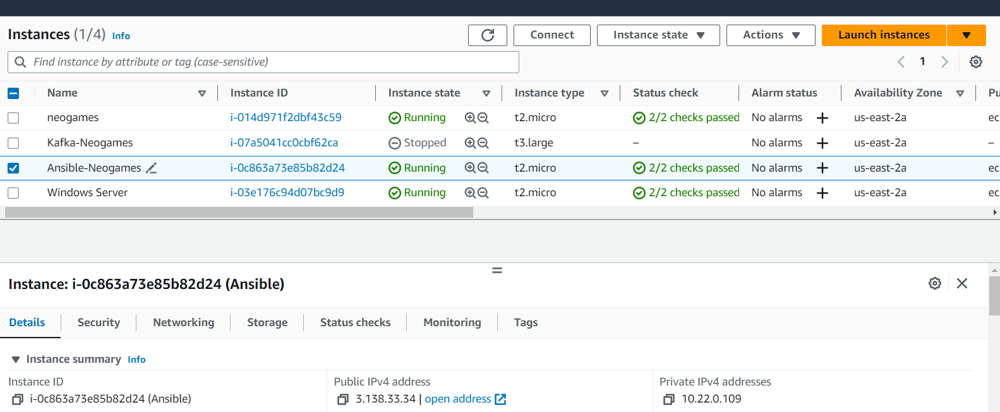
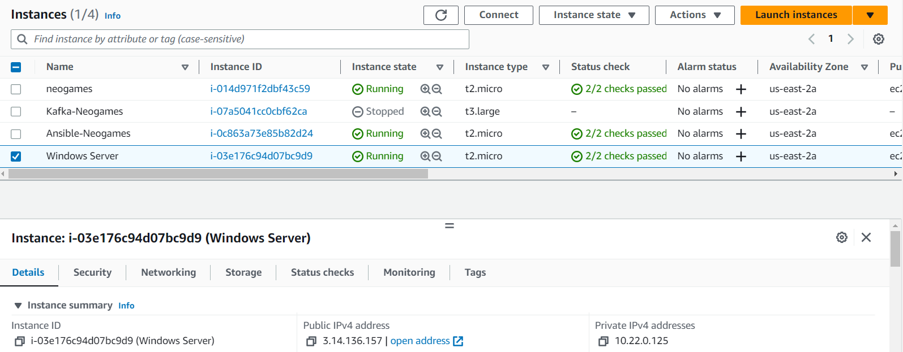
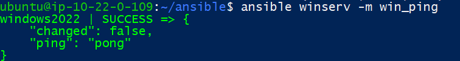
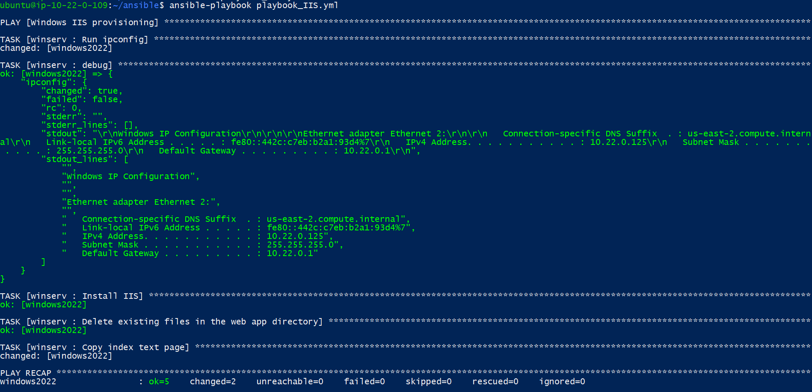

# Windows - Ansible

## Task:
1.	Write an Ansible playbook that installs and configures IIS on a Windows Server 2019 machine. 
The playbook should include tasks for installing IIS, creating a new website, and deploying a sample web application.
2. Create an Ansible playbook that performs the following tasks:
Checks if any updates are available on the Windows host.
If updates are available, download and install them.
If a reboot is required after installing updates, reboots the Windows host.
After the reboot, checks that the updates were installed successfully.
 

#### All screenshots you can find [here](./img)
### Connect Ansible to Windows server
1. Launch a Windows Server instance in AWS Cloud




1. Configure Windows Server instance so that Ansible can run its commands there. To do this, log in to the Windows Server instance and run this [script](https://github.com/ansible/ansible/blob/devel/examples/scripts/ConfigureRemotingForAnsible.ps1).
2. Configure Ansible to connect to the Windows Server instance:
    ```
    [winserv]
    windows2022    ansible_host=3.14.136.157
    ```
    > All other vars [here](./group_vars/winserv):
   
    ```
    ---
    ansible_user                         : Administrator
    ansible_password                     : "Enter your password"
    ansible_port                         : 5986
    ansible_connection                   : winrm
    ansible_winrm_server_cert_validation : ignore
    ```

3. Test the Ansible connection
   ```
   ansible winserv -m win_ping
   ```
   


### Playbook for IIS provisioning
1. Tasks in the playbook:
  ```
  - name: Run ipconfig
    raw: ipconfig
    register: ipconfig
  - debug: var=ipconfig


- name: Install IIS
  win_feature:
    name: "Web-Server"
    state: present
    restart: yes
    include_sub_features: yes
    include_management_tools: yes

- name: Delete existing files in the web app directory
  win_shell: |
    Remove-Item -Path "C:\\inetpub\\wwwroot\\*" -Recurse -Force
  changed_when: false

- name: Copy index text page
  win_copy:
    src: "{{ web_app_source }}"
    dest: "{{ web_app_path }}"
  ```

2. Run playbook:
   ```
   ansible-playbook playbook_IIS.yml
   ```
   

3. Check the result by Windows Server IP address `http://3.14.136.157`:
   


### Create playbook for Windows Patch Management

#### Ansible playbook for patch management:
```
---
- name: Check for Windows updates
  win_updates:
    category_names: '*'
    state: searched
  register: windows_updates

- name: Install Windows updates if available
  win_updates:
    category_names: '*'
    state: installed
  when: windows_updates.updates | length > 0
  register: update_result

- name: Reboot if updates require
  win_reboot:
    reboot_timeout_sec: 300
    async: 0
    poll: 0
  when: update_result.reboot_required | default(false)

- name: Wait for Windows to come back online
  win_ping:
  retries: 300
  delay: 10
  become: false

- name: Check for Windows updates after reboot
  win_updates:
    category_names: '*'
    state: installed
  register: post_reboot_updates

- name: Display update status after reboot
  debug:
    msg: "Updates were installed successfully"
  when: post_reboot_updates.updates | length > 0

- name: Get installed updates
  win_updates:
    state: installed
  register: installed_updates

- name: Display installed updates
  debug:
    var: installed_updates.updates
```


#### Thats all


### Useful links:
+ _https://docs.ansible.com/ansible/latest/os_guide/windows_setup.html_
+ _https://docs.ansible.com/ansible/2.9/modules/list_of_windows_modules.html_
