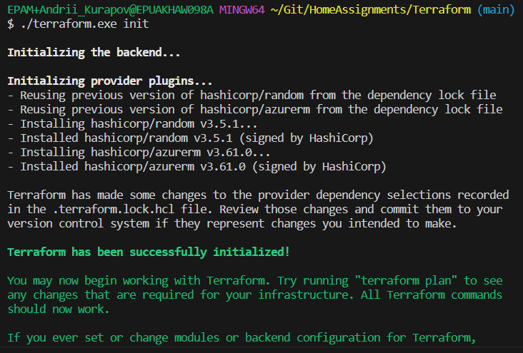
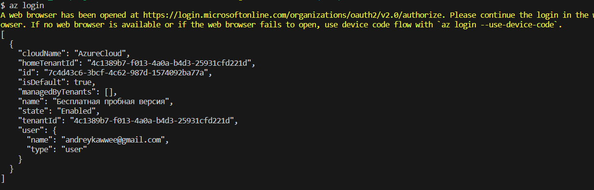
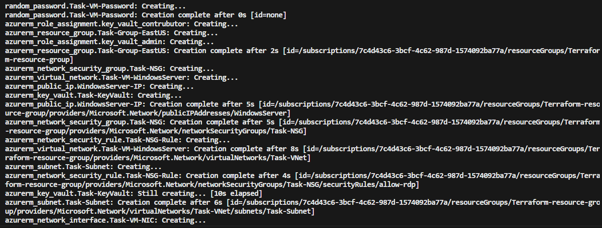
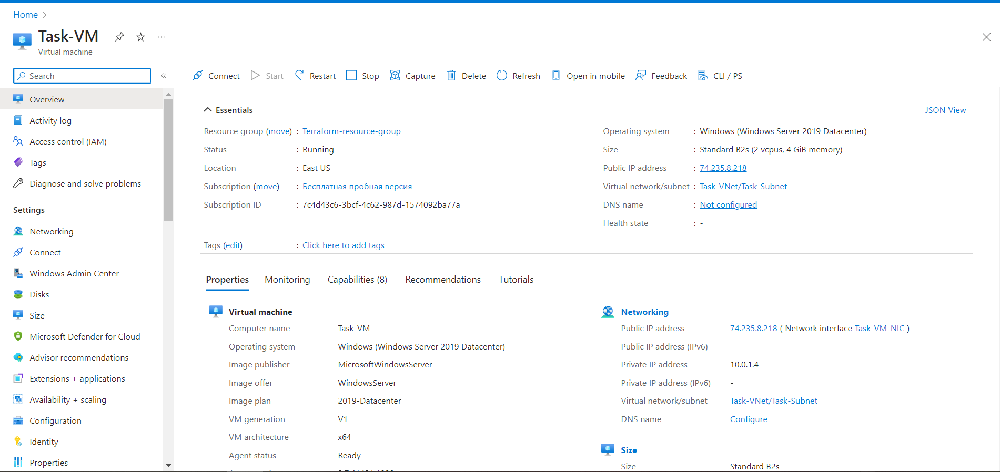
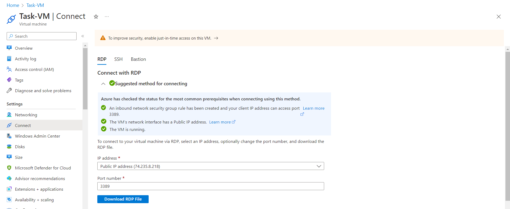
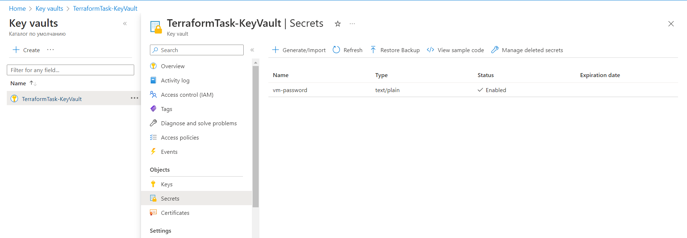

# Terraform task

## Task:
1.	Write a Terraform configuration to create a new Windows Server 2019 VM.
2.	Create Network policy that allows RDP (TCP port 3389)
3.	Increase existing disk size.

### Prerequisites:
- Terraform v1.4.2
- Free Azure Subsription

### Write a Terraform configuration to create a new Windows Server 2019 VM

1. Resource group and network configuration:
```
# Get the current Azure client configuration
data "azurerm_client_config" "current" {}

data "azurerm_subscription" "current" {
  subscription_id = data.azurerm_client_config.current.subscription_id
}

# Define the resource group and location
resource "azurerm_resource_group" "Task-Group-EastUS" {
  name     = "Terraform-resource-group"
  location = "East US"
}

# Create a virtual network
resource "azurerm_virtual_network" "Task-VM-WindowsServer" {
  name                = "Task-VNet"
  address_space       = ["10.0.0.0/16"]
  location            = azurerm_resource_group.Task-Group-EastUS.location
  resource_group_name = azurerm_resource_group.Task-Group-EastUS.name
}

# Create a subnet
resource "azurerm_subnet" "Task-Subnet" {
  name                 = "Task-Subnet"
  address_prefixes     = ["10.0.1.0/24"]
  virtual_network_name = azurerm_virtual_network.Task-VM-WindowsServer.name
  resource_group_name  = azurerm_resource_group.Task-Group-EastUS.name
}

# Create a public IP address
resource "azurerm_public_ip" "WindowsServer-IP" {
  name                = "WindowsServer"
  location            = azurerm_resource_group.Task-Group-EastUS.location
  resource_group_name = azurerm_resource_group.Task-Group-EastUS.name
  allocation_method   = "Dynamic"
}

# Create a network security group
resource "azurerm_network_security_group" "Task-NSG" {
  name                = "Task-NSG"
  location            = azurerm_resource_group.Task-Group-EastUS.location
  resource_group_name = azurerm_resource_group.Task-Group-EastUS.name
}
```
2. Azure Windows Server VM configuration:
```
# Create a virtual machine
resource "azurerm_windows_virtual_machine" "Task-VM" {
  name                  = "Task-VM"
  location              = azurerm_resource_group.Task-Group-EastUS.location
  resource_group_name   = azurerm_resource_group.Task-Group-EastUS.name
  network_interface_ids = [azurerm_network_interface.Task-VM-NIC.id]
  size                  = "Standard_B2s"
  admin_username        = "adminuser"
  admin_password        = random_password.Task-VM-Password.result
  custom_data           = filebase64("diskpart.ps1")
  os_disk {
    name                 = "Task-VM-Disk"
    caching              = "ReadWrite"
    storage_account_type = "Standard_LRS"
    disk_size_gb         = 128
  }
  source_image_reference {
    publisher = "MicrosoftWindowsServer"
    offer     = "WindowsServer"
    sku       = "2019-Datacenter"
    version   = "latest"
  }
}
```
3. Azure VM Network interface configuration:
```
# Create a network interface
resource "azurerm_network_interface" "Task-VM-NIC" {
  name                = "Task-VM-NIC"
  location            = azurerm_resource_group.Task-Group-EastUS.location
  resource_group_name = azurerm_resource_group.Task-Group-EastUS.name

  ip_configuration {
    name                          = "task-ipconfig"
    subnet_id                     = azurerm_subnet.Task-Subnet.id
    private_ip_address_allocation = "Dynamic"
    public_ip_address_id          = azurerm_public_ip.WindowsServer-IP.id
  }
}

# Associate the security group with the network interface
resource "azurerm_network_interface_security_group_association" "Task-NSG-Association" {
  network_interface_id      = azurerm_network_interface.Task-VM-NIC.id
  network_security_group_id = azurerm_network_security_group.Task-NSG.id
}
```
4. Applying random generation for our VM password:
```
# Generate a random password and store it in a Key Vault
resource "random_password" "Task-VM-Password" {
  length  = 16
  special = true
}

resource "azurerm_key_vault" "Task-KeyVault" {
  name                      = "TerraformTask-KeyVault"
  location                  = azurerm_resource_group.Task-Group-EastUS.location
  resource_group_name       = azurerm_resource_group.Task-Group-EastUS.name
  tenant_id                 = data.azurerm_client_config.current.tenant_id
  enable_rbac_authorization = true
  sku_name                  = "standard"
}

# Store the password in the Key Vault
resource "azurerm_key_vault_secret" "Task-VM-Password" {
  name         = "vm-password"
  value        = random_password.Task-VM-Password.result
  content_type = "text/plain"
  key_vault_id = azurerm_key_vault.Task-KeyVault.id
}
```
5. Ensure that we can access Key Vault secret with our password:
```
# Subscription role assignments for Key Vault
resource "azurerm_role_assignment" "key_vault_admin" {
  scope                = "/subscriptions/${data.azurerm_subscription.current.subscription_id}"
  principal_id         = data.azurerm_client_config.current.object_id
  role_definition_name = "Key Vault Administrator"
}

resource "azurerm_role_assignment" "key_vault_contrubutor" {
  scope                = "/subscriptions/${data.azurerm_subscription.current.subscription_id}"
  principal_id         = data.azurerm_client_config.current.object_id
  role_definition_name = "Key Vault Contributor"
}
```
### 2. Create network policy which allows RDP
1. Create network security rule
```
# Add a rule to allow RDP traffic
resource "azurerm_network_security_rule" "Task-NSG-Rule" {
  name                        = "allow-rdp"
  priority                    = 100
  direction                   = "Inbound"
  access                      = "Allow"
  protocol                    = "Tcp"
  source_port_range           = "*"
  destination_port_range      = "3389"
  source_address_prefix       = "*"
  destination_address_prefix  = "*"
  resource_group_name         = azurerm_resource_group.Task-Group-EastUS.name
  network_security_group_name = azurerm_network_security_group.Task-NSG.name
}
```
Don't forget to change the wildcard for destination_address_prefix parameter for your IP address

### Check if our resources deployed successfully:
1. Run terraform init:

2. Log in using Azure CLI:

3. Use terraform apply to deploy our Azure VM:

4. Check VM via Azure Portal:

5. Check VM connectivity via RDP:

6. Check access to Key Vault secret with password:


### 3. Increase existing disk size
To do this, i used this script within custom_data terraform parameter:
```
$diskNumber = 0

# Get the disk object
$disk = Get-Disk -Number $diskNumber

# Extend the partition to use all available space
$partition = Get-Partition -DiskNumber $diskNumber | Where-Object {$_.PartitionNumber -eq 2}
$partition | Resize-Partition -Size ($partition.Size + 1GB) # Add 1GB to the current size

# Extend the volume to use all available space
$volume = Get-Volume -Partition $partition
$volume | Resize-Volume -Size ($volume.Size + 1GB) # Add 1GB to the current size
```
I also tried to do this with winrm remote-exec terraform provisioner:
```
resource "null_resource" "provisioner" {
depends_on = [azurerm_windows_virtual_machine.Task-VM]
  provisioner "remote-exec" {
inline = [
  "$diskNumber = 0",
  "",
  "# Get the disk object",
  "$disk = Get-Disk -Number $diskNumber",
  "",
  "# Extend the partition to use all available space",
  "$partition = Get-Partition -DiskNumber $diskNumber | Where-Object {$_.PartitionNumber -eq 2}",
  "$partition | Resize-Partition -Size ($partition.Size + 1GB) # Add 1GB to the current size",
  "",
  "# Extend the volume to use all available space",
  "$volume = Get-Volume -Partition $partition",
  "$volume | Resize-Volume -Size ($volume.Size + 1GB) # Add 1GB to the current size",
]
    connection {
      type        = "winrm"
      user        = adminuser
      password    = random_password.Task-VM-Password.result
      host        = azurerm_public_ip.WindowsServer-IP.id
      port        = 5986
      timeout     = "5m"
      insecure    = false
    }
  }
}
```
Created NSG rule for 5986 port:
```
# Add a rule to allow WinRM traffic
resource "azurerm_network_security_rule" "Task-NSG-Rule-WinRM" {
  name                        = "allow-winrm"
  priority                    = 101
  direction                   = "Inbound"
  access                      = "Allow"
  protocol                    = "Tcp"
  source_port_range           = "*"
  destination_port_range      = "5986"
  source_address_prefix       = "*"
  destination_address_prefix  = "*"
  resource_group_name         = azurerm_resource_group.Task-Group-EastUS.name
  network_security_group_name = azurerm_network_security_group.Task-NSG.name
}
```
And used [this](https://github.com/ansible/ansible/blob/devel/examples/scripts/ConfigureRemotingForAnsible.ps1) script as custom data for my VM to be able to connect with WinRM provisioner.

Thats all!
